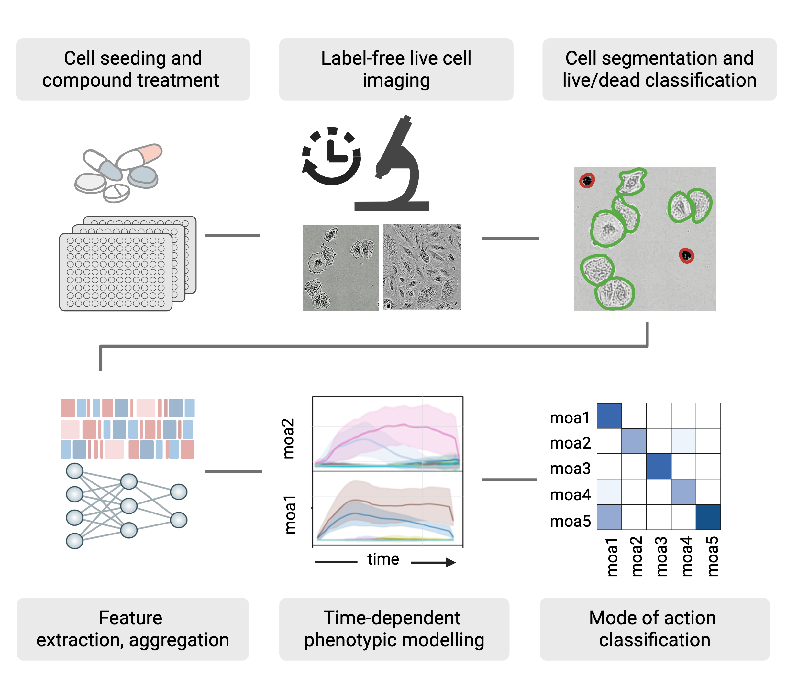

# Live-Cell Temporal Profiling

This repository accompanies the preprint:  
**"The time dimension matters: Improving mode of action classification with live-cell imaging"**

📝 [Read in _Artifical Intelligence in the Life Sciences_ (Open Access)](https://doi.org/10.1016/j.ailsci.2025.100152)

<p align="center">

</p>

## Overview

This codebase supports the analysis presented in the preprint and optionally the feature extraction workflow using DINOv2-based representations.

To run the feature extraction, download the image dataset from [**Figshare**](https://doi.org/10.17044/scilifelab.29315642)

For an overview of the compounds used in the paper see [**Supplementary Table**](https://raw.githubusercontent.com/edvinforsgren/LCTP/refs/heads/main/assets/Supplementary_Table_6.html)

## Getting Started

All shell scripts should be run from the **root directory** of the repository

### 1. Environment Setup
To set up the Python virtual environment and install dependencies:
```bash
./setup.sh
```

### 2. Feature Extraction (**OPTIONAL**)
To run the feature extraction workflow (optional since the features are already available)

```bash
# Will save single-cell crops used later for intensity check and feature extraction
./dino_feature_extraction/1.crop_cells/run_cell_crop.sh
# Will check the intensity of single-cell crops for normalization
./dino_feature_extraction/2.extract_single_cell_features/run_intensity_check.sh
# Will extract single-cell features from the crops
./dino_feature_extraction/2.extract_single_cell_features/run_dino_feat.sh
# Aggregate single-cell features to median well
./dino_feature_extraction/3.get_median_well_features/run_get_median_well.sh
```

### 3. Analysis
To run the single time point and the time series analysis as well as generate the Eq. profile plots:
```bash
./analysis/single_time_point/run_single_time_point.sh
./analysis/time_series/run_time_series.sh
./analysis/time_series/run_plot_time_series.sh
```

### 4. Comparison
To compare the single time point and time series approach in terms of accuracy in confusion matrices use the notebook:
```
./analysis/comparison/confusion_matrix_and_acc.ipynb
```

### 5. Supplementary cross-validation
Results and code for different cross-validation approaches can found in the following branches:
```
supp-cv-7fold
supp-cv-cmpdwise
supp-cv-platewise
```